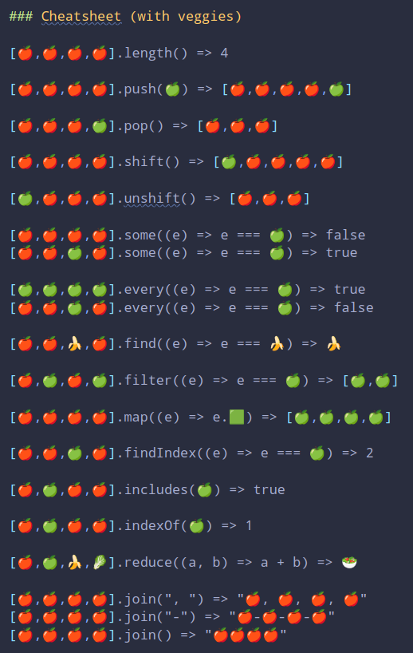

# Week 2 - Challenge 3

​

## Array methods!

​
Replica, sin utilizar ninguno de los métodos ya existentes en el prototipo, los siguientes métodos de array: length, push, pop, unshift, shift, some, every, find, filter, map, findIndex, includes, indexOf, reduce, join
​

### Testea TODOS los métodos.

Contraer
